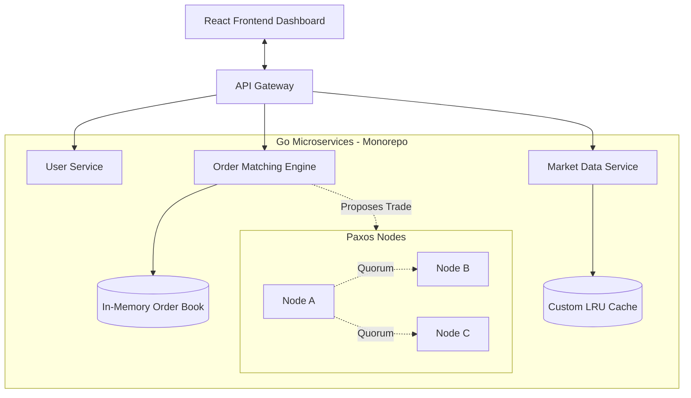

# Distributed Stock Market Trading Platform

A fault-tolerant, microservices-based stock trading platform built from scratch to demonstrate distributed systems principles, high-performance in-memory data structures, and real-time data streaming.

## 🚀 Key Features
*   **Microservices Architecture:** Built with Go (Golang), featuring independent services for Users, Order Matching, and Market Data.
*   **Distributed Consensus (Paxos):** Custom implementation of a Paxos-like consensus algorithm across simulated nodes for fault-tolerant trade settlement and leader election.
*   **High-Performance Order Book:** In-memory order matching engine using Priority Queues (Heaps) for O(log N) trade execution.
*   **Custom LRU Cache:** Thread-safe, doubly-linked-list based LRU cache implementation (no Redis) to serve recent market data.
*   **Real-time Streaming:** WebSockets pushing live order book depth and price updates to a React frontend.

## 🏗️ Architecture



## 🛠️ Local Development

### Prerequisites
*   Docker & Docker Compose

### Start the Cluster
To build and start the entire cluster (3 Microservices, 3 Consensus Nodes, React Frontend):

```bash
docker-compose up --build
```

### Accessing the Platform
*   **Frontend Dashboard:** `http://localhost:3000`
*   **User Service API:** `http://localhost:8081`
*   **Order Matching Engine API:** `http://localhost:8082`
*   **Market Data WebSockets:** `http://localhost:8083`
